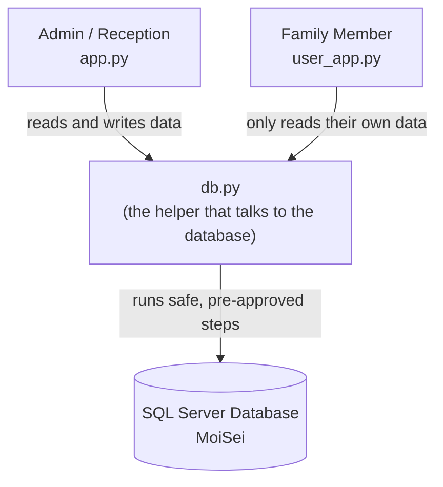
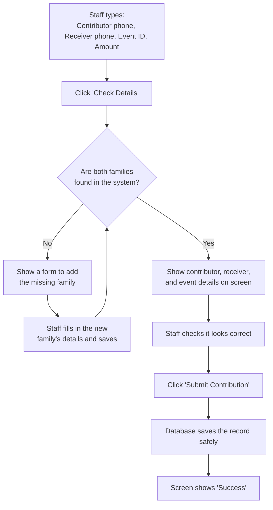
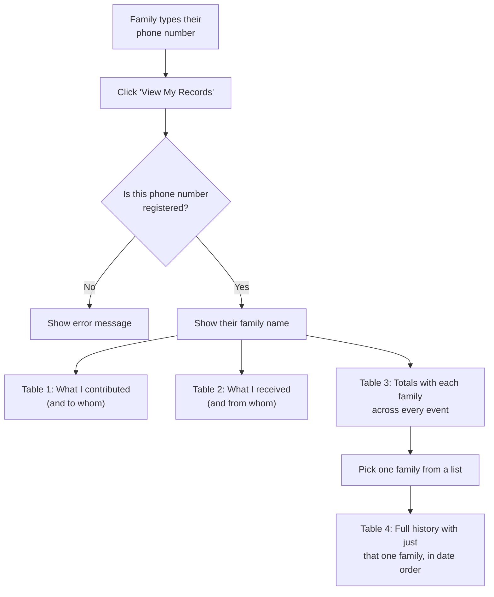
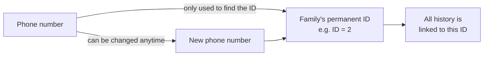

# Moi Sei — Process Flow

## Overall picture

**In plain words:** There are two screens people use — one for staff, one for families. Neither screen talks to the database directly. Both go through one helper file (`db.py`), which is the only thing allowed to open the database.

---

## Flow 1: Staff records a contribution (`app.py`)

---

## Flow 2: Family checks their own history (`user_app.py`)

---

## Why a changed phone number is safe

**In plain words:** The ID never changes. The phone number is just a way to look up the ID — like a nickname. Changing the nickname doesn't erase or move any history, because the history is stored against the ID, not the phone number.

---

## Files in this project

| File | Purpose |
|---|---|
| `backend.sql` | SQL Server schema and stored procedures (source-of-truth setup script) |
| `db.py` | Shared database helper — the only file that talks to SQL Server |
| `app.py` | Admin / Reception Streamlit app — records contributions, can add new families |
| `user_app.py` | Family Portal Streamlit app — read-only, shows only the logged-in family's own history |
